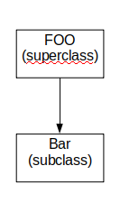
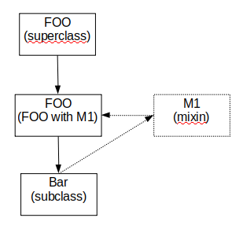

# Mixin C#

## ¿Qué es **mixin**?

En los lenguajes de programación orientada a objetos, un Mixin es una clase que **ofrece cierta funcionalidad** para ser heredada por una subclase, pero no está ideada para ser autónoma. Heredar de un Mixin **no es una forma de especialización** sino más bien un medio de obtener funcionalidad. Una subclase puede incluso escoger heredar gran parte o el total de su funcionalidad heredando de uno o más Mixins mediante herencia múltiple.

Supongamos que tenemos la clase **`Foo`** de la cual hereda **`Bar`**:



¿Cómo podemos agregarle una funcionalidad a **`Foo`** de forma tal que podamos heredarla a través de **`Bar`**?



En la imagen anterior observamos lo siguiente:

- En este caso **`M1`** es una clase que añade funcionalidad.
- Ahora **`Bar`** no hereda directamente de **`Foo`**, o sea, **`Bar`** no es subclase de **`Foo`**, sino una combinación entre **`Foo`** y **`M1`**.
- **`Foo`** no es la superclase de **`Bar`**, sino que en su lugar, lo es el **mixin** (la combinación) de **`Foo-with-M1`**.

Los Mixin son muy útiles cuando se quiere compartir un comportamiento a través de múltiples clases que no compartan la misma jerarquía de clases, o cuando no tiene sentido implementar tal comportamiento en una superclase.

## Pseudo-Mixin en C# 3.0

Como en C# no existe la herencia múltiple, una forma de recrear este patrón es crear interfaces con diferentes funcionalidades. Utilizaremos como ejemplo ilustrativo una estructura de árbol binario. Veamos dicha estructura:


En este caso utilizamos una definición recursiva de árbol binario, donde un árbol binario es un valor genérico (**`T Value`**) con un subárbol izquierdo (**`IBinaryTree<T> Left`**) y otro subárbol derecho (**`IBinaryTree<T> Right`**). Destacar que vimos necesaria una funcionalidad mínima de insertar valores. Además se plantea la restricción de que el tipo **`T`** debe ser capaz de compararse consigo mismo.

```c#
public interface IBinaryTree<T> where T : IComparable<T>{
    T Value { get; set; }
    IBinaryTree<T> Left { get; set; }
    IBinaryTree<T> Right { get; set; }
    void Insert(T value);
}
```

Sobre esta interfaz planteamos la siguiente implementación:

```c#
public class BinaryTree<T> : IBinaryTreeIterator<T>, IBinaryTreeHeigth<T> where T : IComparable<T> {
        public T Value { get; set; }
        public IBinaryTree<T> Left { get; set; }
        public IBinaryTree<T> Right { get; set; }

        public BinaryTree(T value) {
            Value = value;
        }

        public virtual void Insert(T value) {
            if (value.CompareTo(Value) == -1) {
                if (Left == null) {
                    Left = new BinaryTree<T>(value);
                }
                else {
                    Left.Insert(value);
                }
            }
            else {
                if (Right == null) {
                    Right = new BinaryTree<T>(value);
                }
                else {
                    Right.Insert(value);
                }
            }
        }
    }
```

## Iterar sobre los nodos del árbol de modo ***lazy*** y calcular su altura

Uno de los objetivos de la implementación de una funcionalidad es poder decidir su uso o no, por ello planteamos la siguiente solución:

Declarar una interfaz **`IBinaryTreeIterator<T>`** a la cual le agregaremos las funcionalidades de iteración mediante la clase contenedora **`Iterators`**. También declaramos la interfaz **` IBinaryTreeHeigth<T>`**  a la cual le agregamos la funcionalidad de calcular la altura mediante la clase contenedora **`Metrics`**.

```c#
public interface IBinaryTreeIterator<T> : IBinaryTree<T> where T : IComparable<T> { }
```
```c#
public interface IBinaryTreeHeigth<T> : IBinaryTree<T> where T : IComparable<T> { }
```
```c#
public static class Iterators {
        public static IEnumerable<T> PreOrder<T>(this IBinaryTreeIterator<T> tree) where T : IComparable<T> {
            yield return tree.Value;

            if (tree.Left != null) {
                foreach (var item in PreOrder<T>((IBinaryTreeIterator<T>) tree.Left)) {
                    yield return item;
                }
            }

            if (tree.Right != null) {
                foreach (var item in PreOrder<T>((IBinaryTreeIterator<T>) tree.Right)) {
                    yield return item;
                }
            }
        }

        public static IEnumerable<T> InOrder<T>(this IBinaryTreeIterator<T> tree) where T : IComparable<T> {
            if (tree.Left != null) {
                foreach (var item in InOrder<T>((IBinaryTreeIterator<T>) tree.Left)) {
                    yield return item;
                }
            }

            yield return tree.Value;

            if (tree.Right != null) {
                foreach (var item in InOrder<T>((IBinaryTreeIterator<T>) tree.Right)) {
                    yield return item;
                }
            }
        }

        public static IEnumerable<T> PostOrder<T>(this IBinaryTreeIterator<T> tree) where T : IComparable<T> {
            if (tree.Left != null) {
                foreach (var item in PostOrder<T>((IBinaryTreeIterator<T>) tree.Left)) {
                    yield return item;
                }
            }


            if (tree.Right != null) {
                foreach (var item in PostOrder<T>((IBinaryTreeIterator<T>) tree.Right)) {
                    yield return item;
                }
            }

            yield return tree.Value;
        }
    }
```
```c#
public static class Metrics {
    public static int Heigth<T>(this IBinaryTreeHeigth<T> tree) where T : IComparable<T> {
        if (tree == null)
            return 0;
        return 1 + Math.Max(Heigth((IBinaryTreeHeigth<T>) tree.Left), Heigth((IBinaryTreeHeigth<T>) tree.Right));
    }
}
```

En el ejemplo anterior hicimos uso de los métodos extensores. Esto se debe a que los métodos extensores permiten agregar funcionalidades nuevas a tipos previamente declarados o implementados. Deben ser declarados en una clase con el modificador **`static`** al igual que la definición de la funcionalidad. Además del modificador **`static`**, en la declaración de los métodos extensores se destaca que deben tener como primer argumento el tipo al cual queremos agregar la funcionalidad, además de ponerle el modificador **`this`** delante.

Con esta implementación hasta el momento, se puede ejecutar el siguiente código:

```c#
var bt = new BinaryTree<int>(5);
bt.Insert(4);
bt.Insert(7);
bt.Insert(1);
foreach (var value in bt.PreOrder())
    Console.WriteLine(value);
Console.WriteLine("Heigth = {0}", bt.Heigth());
```
*Output:*
```
5
4
1
7
Heigth = 3
```

En caso que se quiera desactivar una funcionalidad, solamente tenemos que dejar de implementar la interfaz correspondiente. En este caso por ejemplo, si se quiere quitar los iteradores basta con declarar la clase como:

```c#
public class BinaryTree<T> : IBinaryTreeHeigth<T> where T : IComparable<T> {
    ...
    ...
}
```

En este caso tenemos el código de la clase **`BinaryTree<T>`** por lo que nos fue fácil agregar o quitar funcionalidades. Pero ¿qué pasaría si no tenemos el código fuente de la clase? ¿Seguimos teniendo la posibilidad de lograr el mismo comportamiento? Para el caso de no tener el código o no querer modificarlo tendríamos que crear una nueva clase (por ejemplo **`MyBinaryTree<T>`**) que herede de **`BinaryTree<T>`**, la cual incorporaría las funcionalidades. Quedando como se muestra a continuación:

```c#
public class BinaryTree<T> : IBinaryTree<T> where T : IComparable<T> { ... }

public class MyBinaryTree<T> : BinaryTree<T>, IBinaryTreeIterator<T>, IBinaryTreeHeigth<T> where T : IComparable<T> {

    public MyBinaryTree(T value) : base(value) { }

    public override void Insert(T value) {
        if (value.CompareTo(Value) == -1) {
            if (Left == null) {
                Left = new MyBinaryTree<T>(value);
            }
            else {
                Left.Insert(value);
            }
        }
        else {
            if (Right == null) {
                Right = new MyBinaryTree<T>(value);
            }
            else {
                Right.Insert(value);
            }
        }
    }
}
```

Con las definiciones anteriores comprobamos que el siguiente código funciona:

```c#
var mbt = new MyBinaryTree<int>(5);
    mbt.Insert(4);
    mbt.Insert(7);
    mbt.Insert(1);
    foreach (var value in mbt.PreOrder())
        Console.WriteLine(value);
    Console.WriteLine("Heigth = {0}", mbt.Heigth());
```

*Output:*
```
5
4
1
7
Heigth = 3
```


## Ventajas y desventajas respecto a la herencia múltiple

* Ventajas de la herencia múltiple
    - Una de las principales ventajas de la herencia múltiple es que cada una de las clases que aportan funcionalidad pueden ser instanciadas, aunque no sea exactamente lo que se quiere lograr con mixin.
    - Además se pueden utilizar los campos de la clase que agrega la funcionalidad, siempre respetando los modificadores de visibilidad.

* Ventajas del mixin
    - Es muy útil para la reutilización de código sin tener que ensuciarse las manos con la semántica de la herencia múltiple.
    - También es práctico por permitir añadir funcionalidades a clases que ya existían previamente, sin modificar su declaración.

**Consideramos que las desventajas de cada uno de ellos es lo opuesto a las ventajas del otro :)**. Además es muy subjetivo el planteamiento de desventajas, ya que depende completamente del contexto de uso. Después de todo mixin es un patrón de diseño que se utiliza solo si es factible.

## ¿Tienen sentido/utilidad los mixins en un lenguaje con herencia múltiple?

Sí tiene sentido, ya que uno de los posibles escenarios que se resuelve con mixin es el *problema del diamante*. Se agrega una funcionalidad directamente sin involucrar al resto de funcionalidades que intervendrían en la herencia.

## Refactorizando código en C++

La refactorización de una jerarquía con herencia múltiple en C++ puede ser representada en C# mediante interfaces como se muestra a continuación:

```c++
class A {
    int a;
    void M1() { ... }
}

class B {
    int b;
    void M2() { ... }
}

class C: A,B { ... }
```

```c#
interface IA {
    int A { get; set; }
}

interface IB {
    int B { get; set; }
}

class C : IA, IB {
    public int A { get; set; }
    public int B { get; set; }
}

static class Methods {
    public static void M1(this IA ia) {
        ...
    }

    public static void M2(this IB ib) {
        ...
    }
}
```

## ¿Qué desventajas tienen el uso de métodos extensores en C#?

- Una de las desventajas es que hay que cargar el namespace completo que lo contiene, aunque sea lo único que se utilice.
- La colisión de estructura puede provocar que un método extensor nunca pueda ser utilizado. Esto sucede si la signatura (nombre y argumentos) del método extensor coincide con alguno de la clase o interfaz.
- Los métodos extensores solo pueden ser eso, métodos. No se pueden declarar operadores, indexadores o propiedades.

## Mixin en C# 8.0

A partir de C# 8 es posible que las interfaces incluyan una implementación por defecto para sus miembros, por lo que pudiéramos definir las interfaces IA e IB de la siguiente forma:

```c#
public interface IA
{ 
    int A { get; set; }
    void M1()
    {
        Console.WriteLine(A);
    }
}

public interface IB
{ 
    int B { get; set; }
    void M2()
    {
        Console.WriteLine(B);
    }
}    
```

Las clases que incluyan su propia version de M1() o M2(), utilizarán estos métodos en lugar de la implementación por defecto, en otros casos, se ejecutará la implementación por defecto proporcionada desde la interfaz.

Pero es importante tener en cuenta un detalle: **`las implementaciones por defecto solo serán accesibles a través de las interfaces que las definen, y no desde las clases que las usan`**. Esto se ilustra en el siguiente bloque de código:

```c#
public interface ID 
{
    void M3() => Console.WriteLine("Soy M3 de ID");
}

public class D : ID { }

static void Main(string[] args)
{
    D d = new D();
    d.M3(); // Compilation error: 
    ID id = new D();
    id.M3(); // "Soy M3 de ID"
}
```

El método M3() no está implementado en la clase D, por lo que no podemos acceder a él. Si queremos hacerlo, debemos informar al compilador de que se trata del M3() definido en la interfaz ID.

Luego de analizar un poco cómo funcionan las interfaces a partir de C# 8, podemos simular la herencia múltiple de la siguiente manera:

```c#
public interface IA
{ 
    int A { get; }
    void M1()
    {
        Console.WriteLine(A);
    }
}

public interface IB
{ 
    int B { get; }
    void M2()
    {
        Console.WriteLine(B);
    }
}

public interface IC : IA, IB { }
```
```c#
public class C : IC
{
    public int A { get; }
    public int B { get; }

    public C(int a, int b)
    {
        A = a;
        B = b;
    }
}
```
```c#
static void Main(string[] args)
{
    IC c = new C(5, 10);
    c.M1(); // 5
    c.M2(); // 10
}
```

Podemos decir que a partir de C# 8 se proporciona soporte para implementar de forma más natural el patrón de diseño Mixin.

## Loosely Coupled

Coupling: Describe cómo las personas o las cosas se conectan unas con otras, en el caso de la programación cómo los programas, o los fragmentos de estos se relacionan entre sí.
En este sentido los podemos dividir entre **tight coupled** (fuertemente acoplado) y **loosely coupled** (débilmente acoplado).

Tight Coupled:
En el diseño fuertemente acoplado los componentes del sistema dependen unos de otros, de manera que si uno falla lleva al fallo de los demás, por otro lado, realizar cambios en en una componente conlleva a realizar cambios generales en el sistema.
Veamos el siguiente ejemplo:

```c#
class ConsoleLogger
{
    public void Log(string message)
    {
        Console.WriteLine(message);
    }
}
```

```c#
ConsoleLogger logger = newConsoleLogger();
logger.Log("Hello");
```

En el ejemplo anterior, si queremos modificar la forma de loggear el sistema, por file, por ejemplo, tenemos que crear un nuevo logger y modificar la creación del logger y la llamada del sistema a la función encargada de loggear de este nuevo logger que puede ya no llamarse **`.Log()`**.

Loosely Coupled:
Las partes del sistema están conectadas, pero las dependencias son débiles, y no tan esenciales como comparadas con tight coupled. El flujo del trabajo está diseñado para ser flexible, podemos de esta forma cambiar una componente sin necesidad de realizar cambios en otra.
Veamos el siguiente ejemplo:

```c#
interface ILogger
{
	void Log(string message);
}

class ConsoleLogger: ILogger
{
	public void Log(string message)
	{
		Console.WriteLine(message);
	}
}
```

```c#
ILogger logger = new ConsoleLogger();
logger.Log("Hello");
```

En este ejemplo, si queremos agregar un nuevo logger lo hacemos implementar la interface ILogger y cambiar la creación, pero este tendrá la función **`.Log()`** que puede seguir siendo llamada en todas las ocurrencias del sistema.

## Inyección de Dependencias

Imaginemos por un momento que tenemos deseos de comer pizza, ñam ñam ñam. Si fuéramos un programa que para alimentarse no usa inyección de dependencias necesitamos saber la receta para hacer una pizza y ponernos manos a la obra; sin embargo, si la usáramos sería tan sencillo como ir a algún sitio a comer la pizza.

Ahora bien, imaginemos que mañana ya no queremos pizza, sino hamburguesa, en el primer caso tendríamos que aprender la receta para las hamburguesas, pero en el segundo bastaría con pedirla en un nuevo sitio.
Más formalmente: una inyección de dependencias consiste en un objeto (o método estático) que depende de otro objeto. Una dependencia es un objeto que puede ser usado (llamado usualmente servicio). Una inyección es el pasar una dependencia a un objeto dependiente (llamado usualmente cliente) el cual lo usará. Pasar un servicio a un cliente en lugar de que el cliente cree o busque por su cuenta el servicio es en lo que consiste este patrón de diseño.

Veamos entonces el ejemplo propuesto en el ejercicio:
```c#
class Dog {
	public void Action() {
	ILogger logger = new ConsoleLogger();
	logger.Log("Bark");
	}
}

int Main(string[] args) {
	var pluto = new Dog();
	pluto.Action();
}
```

## Desventajas del ejemplo:

- Es indispensable conocer cómo se construye un objeto de tipo **`ConsoleLogger`**.
- Las acciones de cualquier **`Dog`** siempre se anotarán en la Consola.
- Imposible utilizar **`FileLogger`** para anotar las acciones de un **`Dog`**.
- Múltiples llamados al constructor de **`ConsoleLogger`**, cada vez que se realiza un llamado a **`Action`**, este pudiera ser costoso.
- La variable **`logger`** se crea para ser usada una única vez y para un único propósito.


### Usando Inyección de Dependencias:
```c#
class Dog {
	private ILogger _logger;
	public Dog(ILogger logger) {
		_logger = logger;
	}
	public void Action() {
		_logger.Log("Bark");
	}
}

int Main(string[] args) {
	var pluto = new Dog(new ConsoleLogger());
	pluto.Action();
}
```

En este segundo caso podemos apreciar que:
- Nuestro **`Dog`** es independiente de cómo se construye un objeto de tipo **`ILogger`**.
- Tenemos la posibilidad de usar cualquier clase que implemente **`ILogger`** para anotar las acciones de un **`Dog`**.
- Para obtener **`_logger`** se copia una referencia, operación O(1).
- La variable **`logger`** proviene de fuera de la clase, pudiera estar recién creada o no, y su uso no es exclusivo para anotar acciones de un **`Dog`**.

Hasta el momento hemos estado analizando la Inyección de Dependecias por construcción pero existen otras variantes como la Inyección de Dependecias por propiedad y por parámetro. Veamos los siguientes ejemplos:

### Por propiedad:
```c#
class Dog {
	public ILogger _logger { get; set; }
	public void Action() {
		_logger.Log("Bark");
	}
}
int Main(string[] args) {
	var pluto = new Dog();
	pluto._logger = new FileLogger();
	pluto.Action();
}
```

### Por parámetro:
```c#
class Dog {
	public void Action(ILogger logger) {
		logger.Log("Bark");
	}
}
int Main(string[] args) {
	var pluto = new Dog();
	pluto.Action(new FileLogger());
}
```

## IoC Containers
Contenedores con Inversión del control (IoC containers): Según Martin Fowler, es un estilo de programación donde la creación de los objetos es responsabilidad de una “entidad” que se le llama “Contenedor”. Al contenedor se le registran las dependencias y es él quien realiza todas las instanciaciones.

## ¿Qué es **IoC**?
Inversión de control (IoC) es un método de programación en el que el flujo de ejecución de un programa se invierte respecto a los métodos de programación tradicionales, en los que la interacción se expresa de forma imperativa haciendo llamadas a procedimientos (procedure calls) o funciones. Tradicionalmente el programador especifica la secuencia de decisiones y procedimientos que pueden darse durante el ciclo de vida de un programa mediante llamadas a funciones. En su lugar, en la inversión de control se especifican respuestas deseadas a sucesos o solicitudes de datos concretas, dejando que algún tipo de entidad o arquitectura externa lleve a cabo las acciones de control que se requieran en el orden necesario y para el conjunto de sucesos que tengan que ocurrir.
El flujo habitual se da cuando es el código del usuario quien invoca a un procedimiento de una biblioteca.
La inversión de control sucede cuando es la biblioteca la que invoca el código del usuario.
Típicamente sucede cuando la biblioteca es la que implementa las estructuras de alto nivel y es el código del usuario el que implementa las tareas de bajo nivel.

Ejemplo:
```c#
interface IContainer {
    void Register<T>(Type implementation);
    T Resolve<T>();
}

class Container: IContainer {...}
```
```c#
interface IAnimal{ 
    void Action(); 
}

class Dog: IAnimal {
    private ILogger _logger;
    public Dog(ILogger logger){ 
        _logger = logger; 
    }
    public void Action(){    
        _logger.Log("Bark");
    }
}

class Cat: IAnimal {
    private ILogger _logger;    
    public Dog(ILogger logger){
         _logger = logger;
    }
    public void Action(){
        _logger.Log("Miau");
    }
}

class Cow: IAnimal { ... } // Muu
```
```c#
var container = new Container();
container.Register<ILogger>(typeof(ConsoleLogger));
container.Register<IAnimal>(typeof(Dog));
var animal = container.Resolve<IAnimal>();
animal.Action();
```

### ¿De qué tipo es la variable **`animal`**?

**`animal`** es del tipo **`Dog`**, ya que el tipo de retorno de **`Resolve`** es **`IAnimal`** y como **`Dog`** implementa esa interfaz mediante el polimorfismo y un casteo se puede devolver un **`Dog`**. De igual manera pasaría si se registra **`Cat`** en vez de **`Dog`**, pues en este caso la variable **`animal`** sería del tipo **`Cat`**.

### ¿Qué imprime la **`animal.Action()`**?

**`animal.Action()`** imprime "Bark", como la variable **`animal`** implementa **`Action`** pero sobre la base de **`Dog`**, se llama al método **`Action`** de **`Dog`**.

### ¿Qué cambio haría falta para que aparezca por pantalla “Muu”?

Es necesario implementar **`Cow`** igual que **`Dog`** y **`Cat`** 
```c#
public class Cow : IAnimal
{
    private ILogger _logger;
    public Cow(ILogger logger) { _logger = logger; }
    public void Action()
    {
        _logger.Log("Muu");
    }
}
```

Cambiar **`Dog`** por **`Cow`** en las siguientes líneas de código:
```c#
container.Register<IAnimal>(typeof(Cow));
var animal = container.Resolve<IAnimal>();
animal.Action();
```

### Proponga la implementación de **`Container`** (utilizando Reflection) para que el código anterior compile.

Usando un diccionario de **`<Type, Type>`** para guardar las implementaciones y mediante reflection se aprovecha la posibilidad de tratar a las instrucciones como datos y así obtener información de estas, podemos hacer recorridos por los constructores del tipo que almacenamos en el diccionario cuya llave es T, y usando recursión obtenemos cada uno de los parámetros para finalmente poder hacer la invocación al constructor.

```c#
public class Container: IContainer
{
    private Dictionary<Type, Type> registers;
    public Container()
    {
        registers = new Dictionary<Type, Type>();
    }

    public void Register<T>(Type implementation)
    {
        Type key = typeof(T);
        
        if (!registers.ContainsKey(key))
            registers.Add(key, implementation);
        else
            registers[key] = implementation;
    }

    public T Resolve<T>()
    {
        return (T)Resolve(typeof(T));
    }

    private object Resolve(Type key)
    {
        Type reflect = registers[key];
        foreach (var m in reflect.GetConstructors())
        {
            var parameters = m.GetParameters();
            List<Type> types = new List<Type>();
            List<object> par = new List<object>();
            foreach (var param in parameters)
            {
                if (param.ParameterType.IsInterface)
                {
                    object dependency = Resolve(param.ParameterType);
                    par.Add(dependency);
                }
                types.Add(param.ParameterType);
            }
            var constructor = reflect.GetConstructor(types.ToArray());
            var instance = constructor.Invoke(par.ToArray());
            return instance;
        }
        throw new Exception("Imposible construir la instacia");
    }
}
```

### ¿Qué se debe hacer en **`Container`** para que las siguientes líneas (por separado) lancen excepción:
```c#
container.Register<ILogger>(typeof(Dog));
container.Register<Dog>(typeof(Wolf)); // Wolf hereda de Dog
```

Se  deben realizar en el **`Container`** una serie de verificaciones como son:
 - Que **`T`** sea de tipo interfaz.
 - Que **`implemetation`** implemente a T(interfaz).
 
 ```c#
 public class Container: IContainer
{
    //...
    public void CheckException(Type key, Type implementation)
    {
        if (key.IsInterface)
        {
            List<Type> interfaces = new List<Type(implementation.GetInterfaces());
            if (!interfaces.Contains(key))
                throw new ArgumentException("La clase de entrada noimplementa la interface especificada.");
        }
        else if (key.IsAbstract && !implementation.IsSubclassOf(key))
            throw new ArgumentException("La clase de entrada no essubclase de la clase especificada.");
        else if (!key.IsInterface && !key.IsAbstract)
            throw new Exception("El tipo llave no puede ser unaimplementación específica.");
    }
    public void Register<T>(Type implementation)
    {
        Type key = typeof(T);
        CheckException(key, implementation);
        //...
    }
    //...
}
 ```

### Explique el funcionamiento de las características de C# utilizadas: reflection, typeof, genericidad, herencia y polimorfismo, etc.

Reflection:
Reflection es el proceso mediante el cual un programa puede observar y cambiar su propia estructura y comportamiento en runtime.
En nuestro código usamos funciones de reflection entre las que se encuentra **`GetParameters()`** para conocer las características de las clases dentro de nuestro contenedor.

Typeof:
El operador **`typeof`** de C# permite obtener una instancia de **`System.Type`** para un tipo específico, a diferencia de **`GetType()`** no es necesario crear una instancia del tipo.  
En la implementación de **`Container`** anterior se aprecia el uso del **`typeof`** para conocer el tipo sin necesidad de tener una instancia.

Genericidad:
En el caso de la genericidad, estudiada ya en clases, la podemos ver en la implementación de **`Container`** para lograr un cdigo que funcionara sin importar el tipo de datos de los parámetros que recibimos.

Herencia:
Se usa para lograr las características de un **`IContainer`** en el **`Container`** implementado por nosotros, así como las características de **`Animal`** en cada uno de los animales.

Polimorfismo:
El polimorfismo se evidencia en la clase **`Program`** al hacer las pruebas con las diferentes clases que implementan **`IAnimal`**.

